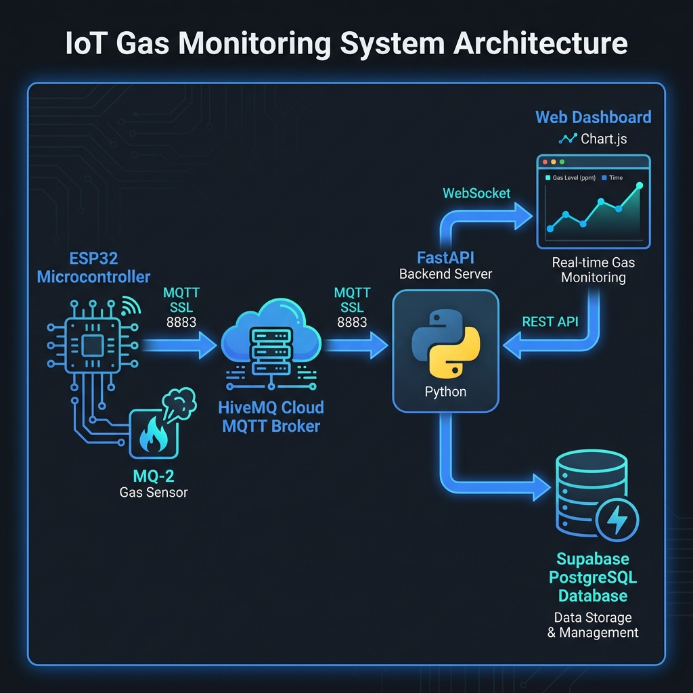

<p align="center">
  
</p>

<h1 align="center">🔥 IoT Gas Monitoring System</h1>

<p align="center">
  <strong>Real-time gas concentration monitoring with cloud-based alerting system</strong>
</p>

<p align="center">
  
  
  
  
  
</p>

<p align="center">
  
  
  
  
</p>

---

## 📋 Table of Contents

- [Overview](#-overview)
- [Features](#-features)
- [System Architecture](#-system-architecture)
- [Safety Levels](#-safety-levels)
- [Tech Stack](#-tech-stack)
- [Project Structure](#-project-structure)
- [Getting Started](#-getting-started)
- [Deployment](#-deployment)
- [API Reference](#-api-reference)
- [ESP32 Hardware Setup](#-esp32-hardware-setup)
- [Contributing](#-contributing)
- [License](#-license)

---

## 🎯 Overview

The **IoT Gas Monitoring System** is a complete end-to-end solution for real-time gas concentration monitoring. Built with a **Hardware-Later** architecture, it enables development and testing without physical hardware, making it ideal for rapid prototyping and academic projects.

The system monitors gas levels using MQ-2 sensors connected to ESP32 microcontrollers, transmits data securely via **HiveMQ Cloud MQTT**, processes it through a **FastAPI** backend, stores readings in **Supabase**, and displays real-time visualizations on a **Bootstrap 5** dashboard.

### 🌟 Key Highlights

- **🔐 Secure Communication**: SSL/TLS encrypted MQTT (port 8883)
- **⚡ Real-time Updates**: WebSocket-based live data streaming
- **📊 Data Persistence**: Supabase PostgreSQL for historical analysis
- **🚨 Smart Alerting**: 4-level Vietnamese safety standard classification
- **🐳 Container Ready**: Docker support for easy deployment
- **☁️ Cloud Native**: Render.com deployment configuration included

---

## ✨ Features

### Dashboard Features
| Feature | Description |
|---------|-------------|
| 📈 **Real-time Chart** | Live Chart.js visualization with 30 data points |
| 🔢 **Current Reading** | Large display with color-coded safety level |
| 📊 **Statistics** | Min, Max, Average, and reading count |
| 🔔 **Alert History** | Table showing recent alerts from database |
| 🔊 **Audio Alerts** | Web Audio API beep sounds for dangerous levels |
| 🌙 **Dark Theme** | Professional dark UI with Bootstrap 5 |

### Backend Features
| Feature | Description |
|---------|-------------|
| 🌐 **REST API** | History and alerts endpoints |
| 🔌 **WebSocket** | Real-time data broadcasting |
| 🗄️ **Database** | Async Supabase integration |
| 📡 **MQTT** | HiveMQ Cloud SSL subscription |
| 🏥 **Health Check** | System status monitoring |

---

## 🏗️ System Architecture

```
┌─────────────────┐      MQTT (SSL)       ┌──────────────────┐
│   ESP32 + MQ-2  │ ──────────────────▶  │  HiveMQ Cloud    │
│   Gas Sensor    │      Port 8883        │  MQTT Broker     │
└─────────────────┘                       └────────┬─────────┘
                                                   │
                                                   ▼
                                          ┌──────────────────┐
                                          │  FastAPI Server  │
                                          │  (Python 3.11)   │
                                          └────────┬─────────┘
                                                   │
                          ┌────────────────────────┼────────────────────────┐
                          │                        │                        │
                          ▼                        ▼                        ▼
                 ┌─────────────────┐     ┌─────────────────┐     ┌─────────────────┐
                 │    Supabase     │     │    WebSocket    │     │    REST API     │
                 │   PostgreSQL    │     │   Broadcasting  │     │   Endpoints     │
                 └─────────────────┘     └────────┬────────┘     └─────────────────┘
                                                  │
                                                  ▼
                                          ┌──────────────────┐
                                          │  Web Dashboard   │
                                          │  Bootstrap 5 +   │
                                          │  Chart.js        │
                                          └──────────────────┘
```

### Data Flow

1. **ESP32** reads analog value from MQ-2 gas sensor
2. **MQTT Publish** sends data to HiveMQ Cloud (SSL encrypted)
3. **FastAPI** subscribes and receives the message
4. **Backend Logic**:
   - Saves reading to `gas_readings` table
   - Determines safety level (4-tier system)
   - If Level 2+: Saves alert to `alerts` table
   - Broadcasts via WebSocket (with `ALERT:` prefix for danger levels)
5. **Dashboard** receives WebSocket message and updates UI in real-time

---

## ⚠️ Safety Levels

The system implements **Vietnamese safety standards** for gas concentration:

| Level | Range (Analog) | Status | Color | Action |
|-------|----------------|--------|-------|--------|
| 🟢 **Level 1** | 300 - 500 | An toàn (Safe) | Green | Normal operation |
| 🟡 **Level 2** | 501 - 900 | Cảnh báo nhẹ (Warning) | Yellow | Log alert |
| 🟠 **Level 3** | 901 - 2000 | Nguy hiểm (Danger) | Red | Trigger siren + Flash |
| 🔴 **Level 4** | > 2000 | Cực kỳ nguy hiểm (Critical) | Dark Red | Urgent siren + Extended flash |

### Alert Behavior

```javascript
// Level 3: Standard danger alert
- Screen flashes red for 3 seconds
- 2 beeps (sine wave, 880Hz)
- Alert saved to database

// Level 4: Critical danger alert  
- Screen flashes red for 5 seconds
- 4 rapid beeps (square wave, 1200Hz)
- Alert saved to database
```

---

## 🛠️ Tech Stack

### Backend
| Technology | Purpose |
|------------|---------|
| **FastAPI** | High-performance async Python web framework |
| **fastapi-mqtt** | MQTT integration with SSL support |
| **supabase-py** | Database client for Supabase |
| **Uvicorn** | ASGI server |
| **python-dotenv** | Environment variable management |

### Frontend
| Technology | Purpose |
|------------|---------|
| **Bootstrap 5** | Responsive UI framework |
| **Chart.js** | Real-time data visualization |
| **Web Audio API** | Alert sound generation |
| **WebSocket API** | Live data streaming |

### Infrastructure
| Technology | Purpose |
|------------|---------|
| **HiveMQ Cloud** | Managed MQTT broker (SSL/TLS) |
| **Supabase** | PostgreSQL database + Auth |
| **Docker** | Containerization |
| **Render** | Cloud deployment platform |

### Hardware
| Component | Purpose |
|-----------|---------|
| **ESP32** | WiFi-enabled microcontroller |
| **MQ-2** | Gas/smoke sensor |

---

## 📁 Project Structure

```
Iot/
├── 📂 backend/
│   └── main.py              # FastAPI application
├── 📂 frontend/
│   └── index.html           # Dashboard (Bootstrap 5 + Chart.js)
├── 📂 simulator/
│   └── gas_sim.py           # Hardware simulator for testing
├── 📂 sketch_jan13a/
│   └── sketch_jan13a.ino    # ESP32 Arduino sketch
├── 📂 docs/
│   └── architecture.png     # System architecture diagram
├── 📄 .env.example           # Environment variables template
├── 📄 .dockerignore          # Docker ignore rules
├── 📄 Dockerfile             # Container configuration
├── 📄 render.yaml            # Render deployment config
├── 📄 requirements.txt       # Python dependencies
└── 📄 README.md              # This file
```

---

## 🚀 Getting Started

### Prerequisites

- Python 3.11+
- Node.js (optional, for local frontend server)
- HiveMQ Cloud account (free tier)
- Supabase account (free tier)

### 1. Clone the Repository

```bash
git clone https://github.com/yourusername/iot-gas-monitor.git
cd iot-gas-monitor
```

### 2. Setup Environment

```bash
# Create virtual environment
python -m venv env
source env/Scripts/activate  # Windows
# source env/bin/activate    # Linux/Mac

# Install dependencies
pip install -r requirements.txt
```

### 3. Configure Environment Variables

```bash
cp .env.example .env
```

Edit `.env` with your credentials:

```env
SUPABASE_URL=https://your-project.supabase.co
SUPABASE_KEY=your-anon-key
MQTT_HOST=your-cluster.hivemq.cloud
MQTT_PORT=8883
MQTT_USER=your-mqtt-username
MQTT_PASS=your-mqtt-password
MQTT_TOPIC=iot/sensor/gas
```

### 4. Setup Supabase Database

Run this SQL in your Supabase SQL Editor:

```sql
-- Devices table
CREATE TABLE devices (
    device_id TEXT PRIMARY KEY,
    name TEXT NOT NULL,
    location TEXT
);

-- Gas readings table
CREATE TABLE gas_readings (
    id BIGSERIAL PRIMARY KEY,
    device_id TEXT REFERENCES devices(device_id),
    value INTEGER NOT NULL,
    created_at TIMESTAMPTZ DEFAULT NOW()
);

-- Alerts table
CREATE TABLE alerts (
    id BIGSERIAL PRIMARY KEY,
    device_id TEXT REFERENCES devices(device_id),
    level INTEGER NOT NULL,
    message TEXT NOT NULL,
    created_at TIMESTAMPTZ DEFAULT NOW()
);

-- Insert default device
INSERT INTO devices (device_id, name, location) 
VALUES ('esp32_01', 'Main Gas Sensor', 'Kitchen');
```

### 5. Start the Backend

```bash
cd backend
uvicorn main:app --reload --host 0.0.0.0 --port 8000
```

### 6. Open the Dashboard

Navigate to: **http://localhost:8000**

### 7. Run the Simulator (Optional)

In a new terminal:

```bash
cd simulator
python gas_sim.py
```

---

## 🐳 Deployment

### Docker

```bash
# Build image
docker build -t iot-gas-monitor .

# Run container
docker run -d -p 8000:8000 \
  -e SUPABASE_URL=your-url \
  -e SUPABASE_KEY=your-key \
  -e MQTT_HOST=your-host \
  -e MQTT_USER=your-user \
  -e MQTT_PASS=your-pass \
  iot-gas-monitor
```

### Render.com

1. Push code to GitHub
2. Connect repo to Render
3. Render auto-detects `render.yaml`
4. Add environment variables in Render dashboard
5. Deploy! 🚀

---

## 📡 API Reference

### WebSocket

| Endpoint | Description |
|----------|-------------|
| `ws://host/ws/gas` | Real-time gas data stream |

**Message Format:**
```json
// Normal reading
{"value": 450, "timestamp": "2026-01-15T10:30:00Z", "level": "SAFE"}

// Alert reading (prefixed with "ALERT:")
ALERT:{"value": 1200, "timestamp": "2026-01-15T10:30:00Z", "level": "DANGER", "message": "NGUY HIỂM!"}
```

### REST Endpoints

| Method | Endpoint | Description |
|--------|----------|-------------|
| GET | `/` | Dashboard HTML |
| GET | `/api` | API information |
| GET | `/api/history` | Last 50 readings |
| GET | `/api/alerts` | Last 10 alerts |
| GET | `/status` | Health check |

---

## 🔌 ESP32 Hardware Setup

### Wiring Diagram

```
ESP32          MQ-2 Sensor
─────          ───────────
3.3V    ────▶  VCC
GND     ────▶  GND
GPIO34  ────▶  A0 (Analog Out)
```

### Arduino Code

See `sketch_jan13a/sketch_jan13a.ino` for the complete ESP32 code.

**Key Configuration:**
```cpp
const char* mqtt_server = "your-cluster.hivemq.cloud";
const int mqtt_port = 8883;
const char* mqtt_topic = "iot/sensor/gas";
```

---

## 🤝 Contributing

Contributions are welcome! Please feel free to submit a Pull Request.

1. Fork the project
2. Create your feature branch (`git checkout -b feature/AmazingFeature`)
3. Commit your changes (`git commit -m 'Add some AmazingFeature'`)
4. Push to the branch (`git push origin feature/AmazingFeature`)
5. Open a Pull Request

---

## 📄 License

This project is licensed under the MIT License - see the [LICENSE](LICENSE) file for details.

---

<p align="center">
  <strong>Built with ❤️ for IoT Course - University Project</strong>
</p>

<p align="center">
  <a href="#-iot-gas-monitoring-system">Back to top ⬆️</a>
</p>
